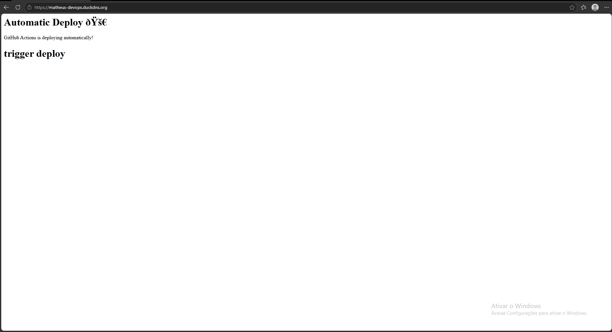

# DevOps Cloud Project 🚀

Production-style DevOps project deployed on AWS using Docker, Nginx, GitHub Actions and HTTPS.

## 🌐 Live Application

https://matheus-devops.duckdns.org

---

# 📌 Project Overview

This project simulates a real-world DevOps environment using:

- AWS EC2
- Docker
- Docker Compose
- Nginx Reverse Proxy
- GitHub Actions CI/CD
- HTTPS with Let's Encrypt
- Linux Server Administration

---

# 🏗️ Architecture

Internet
   ↓
HTTPS
   ↓
Nginx Reverse Proxy
   ↓
Docker Container
   ↓
Static Website

---

# ⚙️ Technologies Used

- Ubuntu Linux
- Docker
- Docker Compose
- Nginx
- AWS EC2
- GitHub Actions
- DuckDNS
- Certbot
- Let's Encrypt

---

# 🚀 Features

✅ Dockerized application  
✅ CI/CD pipeline with GitHub Actions  
✅ Automatic deployment to AWS EC2  
✅ Nginx reverse proxy  
✅ HTTPS with SSL certificate  
✅ Custom domain with DuckDNS  
✅ Linux server management  

---

# 🔄 CI/CD Pipeline

Every push to the main branch automatically:

1. Triggers GitHub Actions
2. Connects to EC2 via SSH
3. Updates the application
4. Rebuilds Docker containers
5. Deploys the latest version

---

# 🐳 Run Locally

# 📷 Screenshots

## Application Preview

